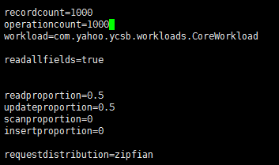
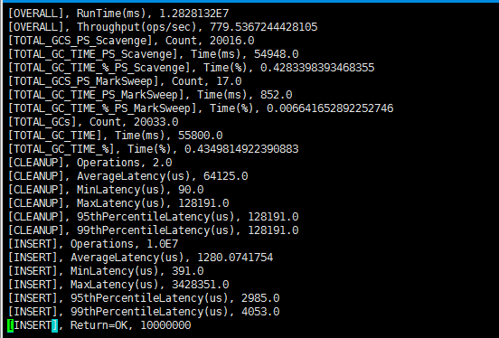
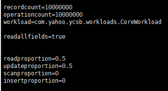
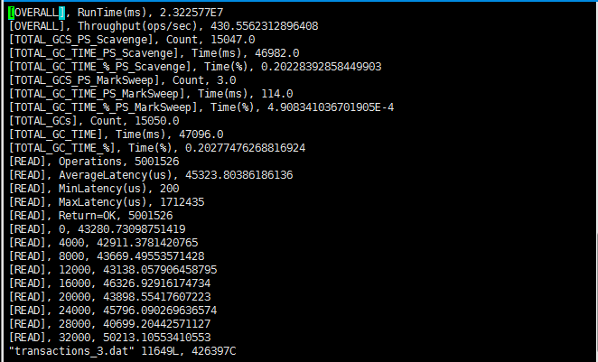

# HBase 性能测试报告

利用 YCSB 对 HBase 进行性能测试

Hbase 集群的有一个主节点 node-a，两个子节点 node-b , node-c 。每个节点的内存 4G ，硬盘 40G 。


## HBase 写测试

YCSB 读写设置的配置文件 在 workloads 目录下

Workloada 文件（以下配置是较低标准）



```bash
recordcount=1000 # 测试数据集的记录条数
operationcount=1000 # 测试过程中执行的操作总数
workload=com.yahoo.ycsb.workloads.CoreWorkload # workload实现类
readallfields=true # 查询时是否读取记录的所有字段
readproportion=0.5 # 读操作的百分比
supdateproportion=0.5 # 更新操作的百分比
scanproportion=0 # 扫描操作的百分比
insertproportion=0 # 插入操作的百分比
```

终端中，进入 ycsb 的目录，在 bin 目录下，输入以下命令：  

```bash
$ ./ycsb load hbase10 -P ../workloads/workloada -p threads=5 -p columnfamily=family -p recordcount=10000000 -s > load_2.dat
```

threads=5 表示启动5个并发线程，columnfamily=family 表示要操作的列簇，在前面我们创建了一个 userdata 表，其中就有 family 这一列簇，recordcount=10000000 表示写入一千万条记录，然后将测试结果存入到 load_2.dat 这一文件中（该文件会自动被创建）。  

load_2.bat  
  

根据上图看出运行时间是 12828132 毫秒， 平均每秒插入数据是 779.5367244428105  
相对于网上搜索的资料，是一个节点内存是 17G ，另外两台是 8G ，每秒插入的数据是 1245 条。  

插入的数据结构  
    

Default data size: 1 KB records (10 fields, 100 bytes each, plus key)
每个 rowkey 包含 10 列数据，为 field0-field9。 


## HBase 读测试

YCSB 读写设置的配置文件 在 workloads 目录下

Workloada 文件（以下配置是较低标准）


```bash
recordcount=10000000 # 测试数据集的记录条数
operationcount=10000000 # 测试过程中执行的操作总数
workload=com.yahoo.ycsb.workloads.CoreWorkload # workload实现类
readallfields=true # 查询时是否读取记录的所有字段
readproportion=0.5 # 读操作的百分比
updateproportion=0.5 # 更新操作的百分比
scanproportion=0 # 扫描操作的百分比
insertproportion=0 # 插入操作的百分比
```

终端中，进入ycsb的目录，在bin目录下，输入以下命令： 

```bash
$ ./ycsb run hbase10 -P ../workloads/workloada –threads 10 -p measurementtype=timeseries -p columnfamily=family -p timeseries.granularity=4000 > transactions_3.dat
```

表示启动 10 个并发线程，将测试结果存入到 transactions_3.dat 这一文件中（该文件会自动被创建）。

transactions_3.dat  
 

根据上图看出运行时间 23225770 毫秒，平均每秒数据是 430 条


## 贡献

本文档由 `尹仁强` 创建，由 `王若凡` 参与整理。
