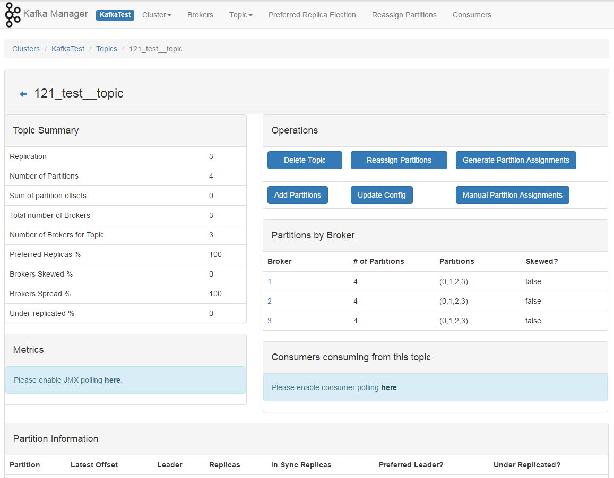

# 部署 Kafka Manager

## 安装 SBT

```bash
$ curl https://bintray.com/sbt/rpm/rpm > bintray-sbt-rpm.repo
$ sudo mv bintray-sbt-rpm.repo /etc/yum.repos.d/
$ sudo yum install -y sbt
```

## 安装 kafka-manager

默认下载最新版（kafka-manager-1.3.1.6）

```bash
$ git clone https://github.com/yahoo/kafka-manager
$ cd kafka-manager
```

```bash
$ sbt clean dist # 编译需要很长时间
$ ls -l target/universal/kafka-manager-1.3.1.6.zip # 编译好的文件
```

解压上图中的 zip 文件

```bash
$ unzip kafka-manager-1.3.1.6.zip
$ cd kafka-manager-1.3.1.6
```

修改 conf/application.conf


即：kafka-manager.zkhosts="192.168.1.121:2181,192.168.1.122:2181,192.168.1.124:2181"
kafka-manager.zkhosts Zookeeper 集群的 hostname 和端口

启动 kafka manager

```bash
$ bin/kafka-manager
```

## Kafka Manager 的 Web 端

启动之后、默认启动的端口是 9000（可更改），在浏览器访问这个地址 http://192.168.1.121:9000 ,然后自己添加一个集群。
其中 Cluster Zookeeper Hosts 为 Zookeeper 集群的 hostname 和端口。


然后就可以看集群的 Brokers，Topic 以及每个 Topic 的详细信息等，如下：

Brokers 信息：


Topic 列表信息：


特定 Topic 的详细信息：



## 容器化

```bash
$ docker run -itd \
    --restart=always \
    --name=kafka-manager \
    -p 9000:9000 \
    -e ZK_HOSTS="192.168.10.199:2181" \
    sheepkiller/kafka-manager
```

访问：<http://192.168.10.199:9000>