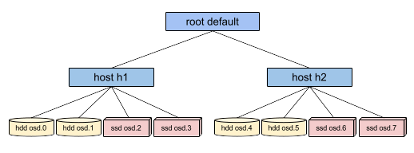

# Device Class（设备类）



## 操作

操作系统会自动探测磁盘设备的类型，默认类型名如下（可以重命名）：

* hdd
* ssd
* nvme

```sh
# 列出设备类
$ ceph osd crush class ls
[
    "hdd"
]
```

```sh
# 重命名设备类
$ ceph osd crush class rename hdd HDD
rename class 'hdd' to 'HDD'
```

```sh
# 查看设备类对应的所 OSD：ceph osd crush class ls-osd <class>
$ ceph osd crush class ls-osd hdd
```

## CRUSH Placement Rules

CRUSH Rule 可以限制 Placement 分发到指定的 Device Class 。

* 副本（replicated）

```sh
# 1. 创建 'replicated' rule
# ceph osd crush rule create-replicated <rule-name> <root> <failure-domain-type> <device-class>
$ ceph osd crush rule create-replicated ssd_rule default host ssd

# 2. 使用上面的 rule 创建 pool
$ ceph osd pool create ssdpool 64 replicated ssd_rule
```

* 纠删码（erasure code）

```sh
# 1. 创建 'erasure code' profile，它设置了期望的设备类和故障域
$ ceph osd erasure-code-profile set k4m2 k=4 m=2 crush-device-class=ssd crush-failure-domain=host

# 2. 使用上面的 profile 创建 pool
$ ceph osd pool create ecpool 64 erasure k4m2
```

## 参考

* [New in Luminous: CRUSH device classes](https://ceph.com/community/new-luminous-crush-device-classes/)
* [DEVICE CLASSES](http://docs.ceph.com/docs/master/rados/operations/crush-map/#device-classes)
