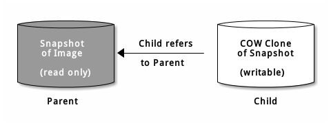

# 快照

快照是镜像在某个特定时间点的一份只读副本。Ceph 块设备支持为镜像创建快照来保留其历史，以及支持分层快照来快速、简便地克隆镜像。

> 做快照前最好先停止 I/O 操作，否则可能获取不到最新的数据。要停止 I/O 操作可以使用 fsfreeze 命令

## CEPHX

如果启用了 `cephx` 认证（默认），必须指定用户名/ID、及其对应的秘钥文件。也可以用 `CEPH_ARGS` 环境变量来避免重复输入下列参数。

```sh
# Syntax
$ rbd --id {user-ID} --keyring=/path/to/secret [commands]
$ rbd --name {username} --keyring=/path/to/secret [commands]
```

```sh
# Example
$ rbd --id admin --keyring=/etc/ceph/ceph.keyring [commands]
$ rbd --name client.admin --keyring=/etc/ceph/ceph.keyring [commands]
```

## 快照基础

* 创建快照

```sh
# rbd snap create {pool-name}/{image-name}@{snap-name}
$ rbd snap create rbd/foo@foosnap
```

* 罗列快照

```sh
# rbd snap ls {pool-name}/{image-name}
$ rbd snap ls rbd/foo
SNAPID  NAME     SIZE  TIMESTAMP
4       foosnap  1024  MB Thu Aug  9 10:22:28 2018
```

* 回滚快照

把镜像回滚到某一快照的意思是，用快照中的数据覆盖镜像的当前版本。从快照 `克隆` 要快于 `回滚` 到某一快照，这也是回到先前状态的首选方法。

```sh
# rbd snap rollback {pool-name}/{image-name}@{snap-name}
$ rbd snap roolback rbd/foo#foosnap
Rolling back to snapshot: 100% complete...done.
```

* 删除快照

```sh
# rbd snap rm {pool-name}/{image-name}@{snap-name}
$ rbd snap rm rbd/foo@foosnap
```

* 清除快照

使用 `rbd snap purge` 可以删除某个镜像的所有快照。

```sh
# rbd snap purge {pool-name}/{image-name}
$ rbd sanp purge rbd/foo
```

## 分层（layering）

Ceph 支持为某一快照创建多个写时复制（COW）克隆。分层快照使得 Ceph 块设备客户端可以很快地创建镜像。例如，先创建一个含 Linux VM 的块设备镜像；然后做快照、保护快照，在创建任意多个 COW 克隆。快照是只读的，所以简化了克隆快照的语义 —— 使得克隆很迅速。



各个克隆出来的子镜像都存储着对父镜像的引用，这使得克隆出来的子镜像可以打开父镜像并读取它。

一个快照的 COW 克隆和 Ceph 块设备镜像的行为完全一致。克隆出来的镜像没有特殊限制，可以读出、写入、克隆、调整克隆镜像的大小。然而快照的 COW 克隆引用了快照，所以克隆快照前必须保护它。

> Ceph 仅支持克隆 format=2 的镜像（即 rbd create --image-format 2）。KRBD 从 3.10 版本支持克隆的镜像

### 分层过程

1. 创建块设备镜像
2. 为镜像创建快照并保护快照
3. 克隆快照


### 分层用法

1. 镜像模板：块设备分层的常见用法是创建一个主镜像及其快照，并作为模板以供克隆。例如，创建一个 CentOS 7.4 的镜像及其快照。
2. 扩展模板：基于基础镜像扩展镜像模板。例如，克隆一个镜像（如 VM 模板）并安装一些软件，再以此扩展镜像做快照，做好的快照可以像基础镜像一样再次进行更新。
3. 模板存储池：创建一个存储池存放作为模板的主镜像和模板快照。然后只分配只读权限给用户，用户就可以进行克隆，而无需分配写和执行权限。
4. 镜像迁移/恢复：可以把某一存储池内的数据迁移或恢复到另一存储池。

### 保护快照

克隆镜像需要引用父快照。如果用户不小心删除了父快照，就会导致所有克隆镜像损坏。所以为防止数据丢失，克隆前必须先保护快照。受保护的快照无法被删除。

```sh
# rbd snap protect {pool-name}/{image-name}@{snapshot-name}
$ rbd snap protect rbd/foo@foosnap
```

```sh
# 校验
$ rbd snap rbd@foo@foosnap
rbd image 'foo':
    size 1024 MB in 256 objects
    order 22 (4096 kB objects)
    block_name_prefix: rbd_data.10276b8b4567
    format: 2
    features: layering
    flags:
    protected: True # 这里
```

### 克隆快照

```sh
# rbd clone {pool-name}/{parent-image}@{snap-name} {pool-name}/{child-image-name}
$ rbd clone rbd/foo@foosnap rbd/img
```

```sh
# 校验
$ rbd ls
foo
img
```

```sh
# 校验
$ rbd info rbd/img
rbd image 'img':
    size 1024 MB in 256 objects
    order 22 (4096 kB objects)
    block_name_prefix: rbd_data.10466b8b4567
    format: 2
    features: layering
    flags:
    parent: rbd/foo@foosnap # 这里
    overlap: 1024 MB
```

### 罗列快照的所有子镜像

```sh
# rbd children {pool-name}/{image-name}@{snapshot-name}
$ rbd children rbd/foo@foosnap
rbd/img
```

### flatten（拍平）克隆镜像

克隆的镜像依然保留了对父快照的引用。要从子克隆删除这些引用，可以把快照的信息复制给子克隆，即 flatten（拍平）它。要删除快照，必须先拍平快照的所有子映像（接着是取消快照保护）。

```sh
# rbd flatten {pool-name}/{image-name}
$ rbd flatten rbd/foo
```

### 取消快照保护

删除快照前，必须先拍平快照的所有子映像，接着取消快照保护。

```sh
# rbd snap unprotect {pool-name}/{image-name}@{snapshot-name}
$ rbd snap unprotect rbd/foo@foosnap
```
