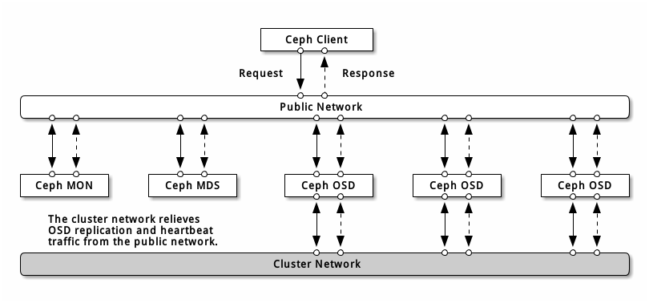

# Ceph 网络配置

推荐运营两个独立网络：一个 `Public Network`（前端） 和一个 `Cluster Network`（后端）。



## 防火墙

* **Monitor 防火墙**

`ceph-mon` 默认总是监听在 `Public Network` 的 `6789` 端口上。

```sh
# {ip-address} 为 Public Network IP
# iptables -A INPUT -i {iface} -p tcp -s {ip-address}/{netmask} --dport 6789 -j ACCEPT
$ iptables -A INPUT -i em1 -p tcp -s 192.168.1.0/24 --dport 6789 -j ACCEPT
$ iptables -A INPUT -i em1 -p tcp -s 192.168.8.0/24 --dport 6789 -j ACCEPT
$ iptables -A INPUT -i em1 -p tcp -s 192.168.10.0/24 --dport 6789 -j ACCEPT # Public Network
```

* **MDS 防火墙**

`ceph-mds` 默认监听 `Public Network` 上从 `6800` 起的第一个可用端口。

```sh
# {ip-address} 为 Public Network IP
# iptables -A INPUT -i {iface} -m multiport -p tcp -s {ip-address}/{netmask} --dports 6800:7300 -j ACCEPT
$ iptables -A INPUT -i em1 -m multiport -p tcp -s 192.168.1.0/24 --dports 6800:7300 -j ACCEPT
$ iptables -A INPUT -i em1 -m multiport -p tcp -s 192.168.8.0/24 --dports 6800:7300 -j ACCEPT
$ iptables -A INPUT -i em1 -m multiport -p tcp -s 192.168.10.0/24 --dports 6800:7300 -j ACCEPT # Public Network
```

* **OSD 防火墙**

`ceph-osd` 默认监听从 `6800` 起的第一个可用端口。一台主机上的各个 OSD 最多会用到 4 个端口：

1. 一个用于和客户端、Monitor 通讯 - Public Network
2. 一个用于发送数据到其他 OSD
3. 两个用于各个网卡上的心跳


```sh
# {ip-address} 为 Public Network IP 或 Cluster Network IP，如果分开了 Public Network 和 Cluster Network，必须分别为之设置防火墙
# iptables -A INPUT -i {iface} -m multiport -p tcp -s {ip-address}/{netmask} --dports 6800:7300 -j ACCEPT
$ iptables -A INPUT -i em1 -m multiport -p tcp -s 192.168.1.0/24 --dports 6800:7300 -j ACCEPT
$ iptables -A INPUT -i em1 -m multiport -p tcp -s 192.168.8.0/24 --dports 6800:7300 -j ACEEPT
$ iptables -A INPUT -i em1 -m multiport -p tcp -s 192.168.10.0/24 --dports 6800:7300 -j ACEEPT # Public Network
$ iptables -A INPUT -i em1 -m multiport -p tcp -s 10.0.10.0/24 --dports 6800:7300 -j ACEEPT # Cluster Network
```

## 网络配置

Ceph 的网络配置要放到 `[global]` 段下。为了安全起见，`Public Network` 或互联网到 `Cluster Network` 应该是不可达的。

* **Public Network**

```ini
[global]
    ...
    public network = {public-network/netmask}
```

* **Cluster Network**

```ini
[global]
    ...
    cluster network = {cluster-network/netmask}
```

## 守护进程

有一个网络配置是所有守护进程都必须要配的：各个守护进程都必须指定 `host`（使用 `hostname -s` 命令获取）。

```ini
[mon.a]
    host = {hostname}
    mon addr = {ip-address}:6789

[osd.0]
    host = {hostname}
```

给守护进程设置静态 IP：

```ini
[osd.0]
    public addr = {host-public-ip-address}
    cluster addr = {host-cluster-ip-address}
```

## 网络配置选项

* **网络**

| 配置选项        | 类型                                              | 描述                                                              |
| --------------- | ------------------------------------------------- | ----------------------------------------------------------------- |
| public network  | {ip-address}/{netmask} [, {ip-address}/{netmask}] | 前端网络的 IP 地址和掩码，置于 `[global]` 下。多个子网用 `,` 分隔 |
| public addr     | {ip-address}                                      | 前端网络的 IP 地址。适用于各个守护进程                            |
| cluster network | {ip-address}/{netmask} [, {ip-address}/{netmask}] | 后端网络的 IP 地址和掩码，置于 `[global]` 下。多个子网用 `,` 分隔 |
| cluster addr    | {ip-address}                                      | 后端网络的 IP 地址。适用于各个守护进程                            |

* **绑定**

| 配置选项         | 类型                                          | 描述                          |
| ---------------- | --------------------------------------------- | ----------------------------- |
| ms bind port min | 类型：32 位整型；默认值：`6800`；是否必需：否 | OSD 或 MDS 可绑定的最小端口号 |
| ms bind port max | 类型：32 位整型；默认值：`7300`；是否必需：否 | OSD 或 MDS 可绑定的最大端口号 |
| ms bind ipv6     | 类型：Boolean；默认值：`false`；是否必需：否  | 允许 Ceph 守护进程 IPv6 地址  |

* **主机**

Ceph 配置文件至少要指定一个 Monitor，且每个 Monitor 下都要配置 `mon addr` 选项；每个 Monitor、MDS 和 OSD 都要配置 `host` 选项。

| 配置选项 | 类型                                            | 描述                                                                  |
| -------- | ----------------------------------------------- | --------------------------------------------------------------------- |
| mon addr | 类型：String；默认值：N/A；是否必需：否         | `{hostname}:{port}` 列表，用以让客户端连接 Ceph Monitor               |
| host     | 类型：String；默认值：`localhost`；是否必需：是 | 主机名（通过 `hostname -s` 命令获取）。用于特定守护进程，如 `[osd.0]` |

> 使用第三方部署工具时不要指定 host 选项，它会自行获取