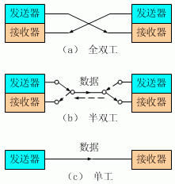

# 通信信道

_通信信道_（Communication Channel）又叫 _信道_、_通道_ 或 _频道_，是指信息可以传输的通道，它以 **传输介质** 和 **通信中继设置** 为基础。传输介质可以是有形的（如：双绞线、电缆和光纤），也可以是无形的（如：传播电磁波的空间）。

## 传输方式

### 单工、半双工、全双工

_通信信道_ 按信息传输的方向划分，可以分为 `单工`、`半双工`、`全双工` 三种工作模式。

| 工作模式              | 描述                                                             | 应用场景                   |
| --------------------- | ---------------------------------------------------------------- | -------------------------- |
| 单工（simplex）       | 数据信号始终是单向传输；发送端只能发送数据，接收端只能接受数据   | 无线电广播、电视广播、遥控 |
| 半双工（half duplex） | 数据信号可以是双向传输，但通信双方不能同时（同一时间段）收发数据 | 早期对讲机、集线器         |
| 全双工（full duplex） | 数据信号可以同时双向传输                                         | 交换机、路由器             |

半双工例子：一条窄窄的马路，只允许有一辆车通过，当有两辆车对开时，只能让一辆车先过，等到终点后另一辆再开

### 基带传输和频带传输

### 异步传输与同步传输

## 参考

* [通信信道（Communication Channel）](https://wiki.mbalib.com/wiki/%E9%80%9A%E4%BF%A1%E4%BF%A1%E9%81%93)
