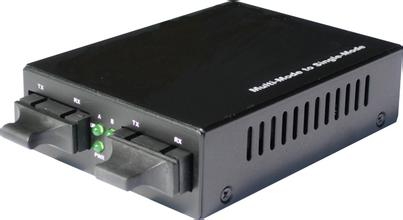
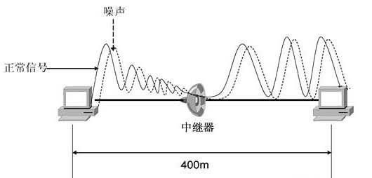

# 中继器（RP repeater）

中继器（**Repeater**）又叫做 “放大器”。作用是放大信号，解决物理线路不够长而引起的信号衰减的问题。

## 作用

* 放大信号
* 延长线路

## 优缺点

优点：

* 扩大了通信距离（代价是增加了存储转发延时）

缺点：

* 端口较少
* 增加了存储转发延时（中继器缓存区具有存储空间），这也导致它不可能无限长
* 放大正常信号的同时，也放大了噪声信号
* 由于是物理层设备，所以无法读懂和修改上层 MAC 帧，也就无法完成更多的选路及优化转发的特性，只能起到放大信号和延长线路的作用
* 网络标准中都对信号的延迟范围作了具体的规定，中继器只能在此规定范围内进行有效的工作（不能无限长），否则会引起网络故障。

## 工作原理

## 参考

* [中继器工作原理](http://book.51cto.com/art/201409/450858.htm)
