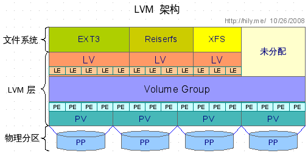

# LVM（Logical Volume Management）

## 概述



* PP（Physical Partition）：物理分区；磁盘分区或 RAID 分区
* PV（Physical Volume）：物理卷；PP 的 LVM 抽象，它维护了 PP 的结构信息，是组成 VG 的基本逻辑单元，通常一个 PV 对应一个 PV
* PE（Physical Exetends）：物理扩展单元；每个 PV 都会以 PE 为基本单元进行划分，通常为 4MB
* VG（Volume Group）：LVM 卷组；相当于 LVM 的存储池
* LV（Logical Volume）：逻辑卷；在 VG 之上，文件系统之下，由若干个 LE 组成
* LE（Logical Extends）：逻辑扩展单元；LV 的基本单元，一个 LE 对应一个 PE

## LVM 管理

### 安装 lvm

```bash
# ubuntu
$ apt-get install -y lvm2

# centos
$ yum install -y lvm2
```

### 磁盘准备

```bash
# 如果是使用整块磁盘，必须先擦除分区表，这将删除磁盘上的所有数据
$ dd if=/dev/zero of=/dev/sdb bs=512 count=1
$ dd if=/dev/zero of=/dev/sdc bs=512 count=1
```

```bash
# 创建两个主分区，分区类型为 8e
# 流程：n -> p -> 1 -> Enter -> Enter -> w
$ fdisk /dev/sdb
$ fdisk /dev/sdc
```

### PV 管理

```bash
# 创建两个物理卷（PV）
$ pvcreate /dev/sdb1 /dev/sdc1
Physical volume "/dev/sdb1" successfully created.
Physical volume "/dev/sdc1" successfully created.
```

```bash
# 删除物理卷
$ pvremove /dev/sdc1
Labels on physical volume "/dev/sdc1" successfully wiped.

# pvmove /dev/sdc1
```

```bash
# 查看物理卷状态
$ pvscan
$ pvdisplay
$ pvdisplay /dev/sdb1

# 列出物理卷
$ pvs
$ pvs -o+pv_used
PV         VG     Fmt  Attr PSize   PFree   Used
/dev/sda1  k8s    lvm2 a--  894.25g 894.25g 0
/dev/sdb2  centos lvm2 a--  557.37g 4.00m   <557.37g
```

## VG 管理

```bash
# 创建逻辑卷组：将一个个物理卷添加到一个存储池（卷组不存在时）
$ vgcreate vg1 /dev/sdb1 /dev/sdc1
Volume group "vg1" successfully created
```

```bash
# 扩展逻辑卷组：将新的分区添加到现有卷组中（卷组已存在时）
$ vgextend vg1 /dev/sdd1
```

```bash
# 先移出想要移除的物理卷，以便 LV 中的数据可以迁移到其他 PV　上
$ pvmove /dev/sdd1

# 再从逻辑卷组中移除物理卷
$ vgreduce k8s /dev/sdd1
```

```bash
# 删除逻辑卷组
$ vgremove vg1
```

```bash
# 查看逻辑卷组状态
$ vgscan
$ vgdisplay

# 列出逻辑卷组
$ vgs
VG      PV  LV  SN Attr   VSize   VFree
centos   1   2   0 wz--n- 557.37g   4.00m
k8s      1   0   0 wz--n- 894.25g 894.25g
```

## LV 管理

```bash
# 创建逻辑卷
$ lvcreate --name lv1 --size 4G vg1
$ lvcreate -n lv2 -L 8G vg1
```

```bash
# 删除逻辑卷
$ lvremove /dev/vg1/lv2
```

```bash
# 查看逻辑卷
$ lvdisplay
$ lvdisplay vg1
$ lvdisplay /dev/vg1/lv1

# 扫描可用物理卷的块设备
$ lvmdiskscan

# 列出逻辑卷
$ lvs
$ lvs vg1
LV    VG  Attr       LSize Pool Origin Data%  Meta%  Move Log Cpy%Sync Convert
lv1   k8s -wi-a----- 2.00g
lv2   k8s -wi-a----- 1.00g
```

```bash
# 扩大逻辑卷大小
$ lvextend -L 10G /dev/vg1/lv1
```

```bash
# 减少逻辑卷大小
$ lvreduce -L 2G /dev/vg1/lv1
```

```bash
# 修改逻辑卷名称
$ lvrename vg1/lv1 lv001
```

## 文件系统管理

```bash
# 格式化逻辑卷
$ mkfs.ext4 /dev/vg1/lv1

# 挂载逻辑卷
$ mount /dev/vg/lv1 /mnt/lv1

# 查看挂载
$ df -h
```

```bash
# 开机自动挂载（最好使用 UUID：lvdisplay /dev/vg1/lv1 | grep 'LV UUID'）
$ vi /etc/fstab
/dev/vg1/lv1 /mnt/lv1 ext4 rw,noatime 0 0
```

## 注意事项

不建议将引导（`boot`）分区防止 LVM 上，参考 [Why it is not recommended to put boot partition on lvm?](https://unix.stackexchange.com/questions/199586/why-it-is-not-recommended-to-put-boot-partition-on-lvm)。

典型的用法：

* /boot – Non LVM
* /(root) – LVM
* Swap – LVM

## 参考

* [LVM](https://wiki.archlinux.org/index.php/LVM_(%E7%AE%80%E4%BD%93%E4%B8%AD%E6%96%87))
* [Ubuntu Server 上的 LVM 配置](http://www.cnblogs.com/yasmi/articles/4835644.html)
* [简单理解LVM(Logical Volume Manager)的基本原理](https://blog.csdn.net/ustc_dylan/article/details/7878284)
* [LVM (Logical Volume Manager)](https://www.centos.org/docs/5/html/Deployment_Guide-en-US/ch-lvm.html)
* [Creating Physical Volumes](https://www.centos.org/docs/5/html/Cluster_Logical_Volume_Manager/physvol_create.html)
* [LOGICAL VOLUME MANAGER ADMINISTRATION](https://access.redhat.com/documentation/en-us/red_hat_enterprise_linux/5/html/logical_volume_manager_administration/)