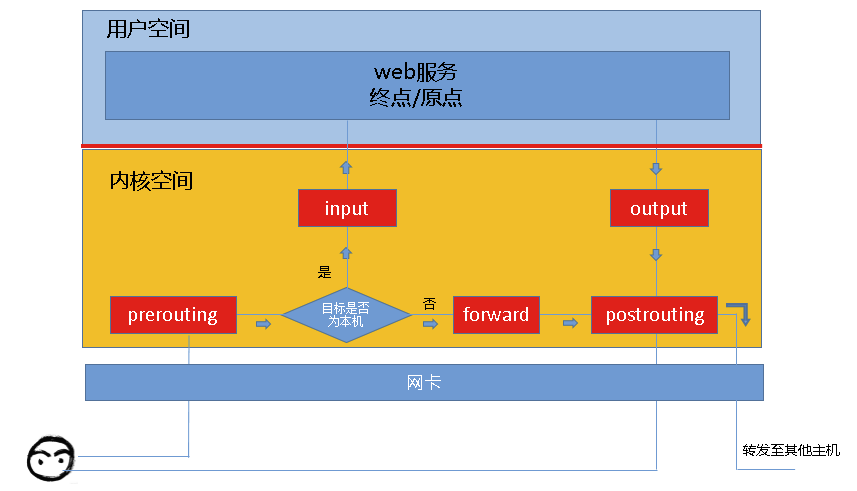

# iptables

## 规则（rule）

规则即网络管理员预定义的条件，一般定义：如果数据包头符合这样的条件，就这样处理这个数据包。

规则存储在内核空间（kernel space）的信息过滤表中。

规则有匹配条件和处理动作组成。

### 匹配条件

匹配条件分为基本匹配条件和扩展匹配条件。基本匹配条件：源地址（Source IP）和目标地址（Destination IP）。扩展匹配条件：源端口（Source Port）和目标端口（Destination Port）。

### 处理动作

处理动作在 iptables 中称为 target 。动作分为基本动作和扩展动作。

| target     | 描述                                                                         |
| ---------- | ---------------------------------------------------------------------------- |
| ACCEPT     | 允许数据包通过                                                               |
| DROP       | 直接丢弃数据包，不给任何回应信息                                             |
| REJECT     | 拒绝数据包通过；必要时给数据发送端一个响应信息，客户端刚请求就收到拒绝信息。 |
| SNAT       | 源地址转换；解决内网用户用同一个公网地址上网的问题                           |
| MASQUERADE | SNAT 的一种特殊形式，适用于动态的、临时会变的 ip 上                          |
| DNAT       | 目标地址转换                                                                 |
| REDIRECT   | 在本机做端口映射                                                             |
| LOG        | 在 /var/log/messages 中记录日志，然后将数据包传递给下一条规则                |
| RETURN     | 停止遍历此链并在前一个（调用）链中的下一个规则处继续                         |

## 链（chain）



当开启防火墙功能时，根据实际情况的不同，报文所经过的“链”也可能不同。

| 常见场景                 | 报文流向                               |
| ------------------------ | -------------------------------------- |
| 到本机某进程的报文       | PREROUTING --> INPUT                   |
| 由本机转发的报文         | PREROUTING --> FORWARD --> POSTROUTING |
| 有本机某进程发出的数据包 | OUTPUT --> POSTROUTING                 |

### 链的概念

多条规则串在一起形成了 “链”。

每个经过“链”的报文，都要将“链”上的所有规则匹配一遍，如果有符合条件的规则就执行对应的动作。

### 预定义链 - `5 个链`

* INPUT
* OUTPUT
* PREROUTING
* FORWARD
* POSTROUTING

## 表（table） - `4 张表`

* filter
* nat
* mangle
* raw

优先级由高到低：`raw --> mangle --> nat --> filter`

### 表的概念

具有相同功能的规则的集合叫做“表”。所以，不同功能的规则可以放在不同的表中进行管理。

### 预定义表

iptables 预定义了 4 种表，每种表都对应不同的功能，而我们定义的规则都脱离不了这 4 中功能的范围。

| 表     | 对应内核模块   | 功能                            |
| ------ | -------------- | ------------------------------- |
| filter | iptable_filter | 负责过滤功能，防火墙            |
| nat    | iptable_nat    | 网络地址转换功能                |
| mangle | iptable_mangle | 拆解报文，做出修改并重新封装    |
| raw    | iptable_raw    | 关闭 nat 表上启用的连接追踪机制 |

我们自定义的所有规则都是四种分类中的规则，或者说所有规则都存在于这四张表中。

### 表链关系

#### 链与表

| 链          | 其规则存在于哪些表                               |
| ----------- | ------------------------------------------------ |
| PREROUTING  | raw, mangle, nat                                 |
| INPUT       | mangle, filter（centos7 还有 nat，centos6 没有） |
| FORWARD     | mangle, filter                                   |
| OUTPUT      | raw, mangle, nat, filter                         |
| POSTROUTING | mangle, nat                                      |

当四张表处于同一条链时，其执行的优先级为：`raw` --> `mangle` --> `nat` --> `filter`。

数据包经过防火墙的流程总结（牢记路由次序，灵活配置规则）：


#### 表与链

| 表     | 被哪些链使用                                                        |
| ------ | ------------------------------------------------------------------- |
| raw    | PREROUTING, OUTPUT                                                  |
| mangle | PREROUTING, INPUT, FORWARD, OUTPUT, POSTROUTING                     |
| nat    | PREROUTING, OUTPUT, POSTROUTING（centos7 还有 INPUT, centos6 没有） |
| filter | INPUT, FORWARD, OUTPUT                                              |


## 规则查询

### 查看表的规则

```sh
# 列出表中的所有规则
$ iptables -t filter -L
$ iptables -t raw -L
$ iptables -t mangle -L
$ iptables -t nat -L

# 没有 -t 选项默认操作 filter 表
$ iptables -L
```

### 查看表中指定链的规则

```sh
# 查看 filter 表中 INPUT 链的规则
$ iptables -L INPUT
$ iptables -vL INPUT # 更详细
Chain INPUT (policy ACCEPT 2545K packets, 1319M bytes)
pkts  bytes target        prot opt in  out source   destination
3070K 1629M KUBE-FIREWALL all  --  any any anywhere anywhere

# 以上命令源地址和目标地址的都是 anywhere
# iptables 默认进行了名称解析，当规则较多时查询效率低下；可以使用 -n 选项不对 IP 地址进行名称解析
$ iptables -nvL

# 带有序号
$ iptables --line -nvL INPUT
$ iptables --line-numbers -nvL INPUT
```

字段就是规则所对应的属性。

| 字段        | 含义                                                                         |
| ----------- | ---------------------------------------------------------------------------- |
| pkts        | 对应规则匹配到的报文个数                                                     |
| bytes       | 对应匹配到的报文包的大小总和                                                 |
| target      | 规则对应的 target，往往表示规则对应的”动作“，即规则匹配成功后采取的措施      |
| prot        | 表示规则对应的协议，是否只针对某些协议应用次规则                             |
| opt         | 表示规则对应的选项                                                           |
| in          | 表示数据包有哪个网卡接口流入；可以设置哪块网卡流入的报文需要匹配当前规则     |
| out         | 表示数据包由哪个网卡接口流出；可以设置通过哪块网卡流出的报文需要匹配当前规则 |
| source      | 表示规则对应的源地址，可以是一个 IP 或网段                                   |
| destination | 表示规则对应的目标地址，可以是一个 IP 或网段                                 |

## 内核模块

Different kernel modules and programs are currently used for different protocols:

* ip_tables(IPV4)
* ip6_tables(IPV6)
* arp_tables(ARP)
* ebtables(Ethernet frames)

They provide a table-based system for defining firewall rules that can filter or transform packets

## chains of rules

Rules are organized into chains, or in other words, "chains of rules".These chains are named with predefined titles, including `INPUT`, `OUTPUT` and `FORWARD`.

Packet reception falls into `PREROUTING`, while the `INPUT` represents locally delivered data, and forwarded traffic falls into the `FORWARD` chain. Locally generated output passes through the OUTPUT chain, and packets to be sent out are in `POSTROUTING` chain.

## 参考

* [iptables 详解](http://www.zsythink.net/archives/tag/iptables/)
* [How To Migrate from FirewallD to Iptables on CentOS 7](https://www.digitalocean.com/community/tutorials/how-to-migrate-from-firewalld-to-iptables-on-centos-7)
* [Netfilter](https://en.wikipedia.org/wiki/Netfilter)
* [Iptables](https://en.wikipedia.org/wiki/Iptables)