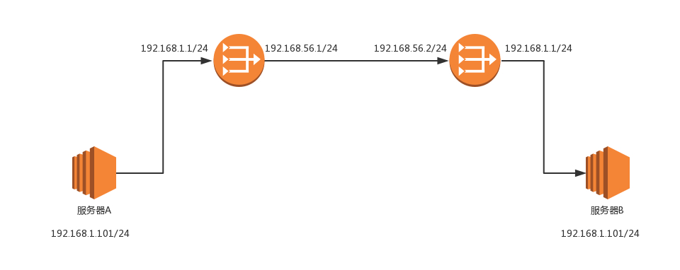

# 网关

如果想离开当前局域网访问到外网，就需要先经过 `网关`，网关是路由器的一个网口地址。通常，家用路由器的所有 LAN 口都使用同一个网关地址和 MAC 地址，而企业路由器可以指定哪些 LAN 口属于哪个网段，甚至可以自定义 WAN 口和 LAN 口。

## 网关类型

IP 头和 MAC 头哪些变、哪些不变？

MAC 地址是一个局域网内才有效的地址。所以，MAC 地址只要过网关，就必定会改变，因为已经换了局域网。两者主要的区别在于 IP 地址是否改变：

* **转发网关** - 不改变 IP 地址的网关
* **NAT 网关** - 改变 IP 地址的网关

## 转发网关

1. Server-A 要访问 Server-B
2. Server-A 确定 Server-B 与自己不在同一网段，所以将网络包发送给网关（静态配置的 `192.168.1.1`，**网关必须和当前设备位于同一局域网，且网关设备必须真实存在**）
3. 为了发送网络包给网关，Server-A 需要先发送 APR 请求获取网关的 MAC 地址，然后再发送网络包。包的内容如下：
    * **源 MAC 地址**：Server-A 的 MAC 地址
    * **目标 MAC 地址**：网关（`192.168.1.1` 网口）的 MAC 地址
    * **源 IP 地址**：`192.168.1.101`
    * **目标 IP 地址**：`192.168.4.101`
4. 网络包到达 `192.168.1.1` 网口，发现 MAC 地址一致，将包收进来，开始思考往哪里转发
5. 在 Router-A  配置静态路由后，要访问 `192.168.4.0/24`，需要从 `192.168.56.1` 网口出去，下一跳是 `192.168.56.2`
6. Router-A 要从 `192.168.56.1` 网口发送数据包到 `192.168.56.2`，需要先发送 ARP 请求获取 `182.168.56.2` 的 MAC 地址，然后在发送数据包。包的内容如下：
    * **源 MAC 地址**：`192.168.56.1` 的 MAC 地址
    * **目标 MAC 地址**：`192.168.56.2` 的 MAC 地址
    * **源 IP 地址**：`192.168.1.101`
    * **目标 IP 地址**：`192.168.4.101`
7. 网络包到达 `192.168.56.2` 网口后，发现 MAC 地址一致，将包收进来，开始思考往哪里转发
8. 在 Router-B 配置静态路由后，要访问 `192.168.4.0/24` 需要从 `192.168.4.1` 网口出去，没有下一跳了。
9. Route-B 配置静态路由规则，需要从 `192.168.4.1` 网口出去访问 `192.168.4.101`
10. Route-B 发送 ARP 请求获取 `192.168.4.101` 的 MAC 地址，然后在发送网络包。包的内容如下：
    * **源 MAC 地址**：`192.168.4.1` 的 MAC 地址
    * **目标 MAC 地址**：`192.168.4.101` 的 MAC 地址
    * **源 IP 地址**：`192.168.1.101`
    * **目标 IP 地址**：`192.168.4.101`
11. 数据包到达 Server-B，MAC 地址匹配，将包收进来

通过这个过程可以看出，每到一个新的局域网，**MAC 地址都要改变，而 IP 地址都不变**，并且 **IP 头里面不会保存任何网关的 IP 地址**。

**所谓的下一跳，指的是某个 IP 要将这个 IP 转换为 MAC 放入 MAC 头**。

## NAT 网关

存在的问题：局域网之间没有实现商量过，各定各的网段，导致 IP 段冲突。如上图所示，如果单从 IP 地址来看，简直就是自己访问自己。

如何解决：既然局域网之间没有商量过，那到国际上即中间的局域网里面，就需要使用另外的地址。就像出国不能使用自己的身份证，而要改用护照一样。

1. 目标服务器 B 在国际上需要一个国际身份（`192.168.56.2`），并在 Router-B 上记录，国际身份 `192.168.56.2` 对应国内身份 `192.168.1.101`。凡是访问 `192.168.56.2`，都转换成 `192.168.1.101`
2. Server-A 要访问 Server-B，要指定的目标地址为 `192.168.56.2`，由于不在统一网段，所以需要发送给网关（静态配置的 `192.168.1.1`）。发送前需要先发送 ARP 请求获取网关的 MAC 地址，然后在发送数据包。包的格式如下：
    * **源 MAC 地址**：Server-A 的 MAC 地址
    * **目标 MAC 地址**：网关（`192.168.1.1` 网口）的 MAC 地址
    * **源 IP 地址**：`192.168.1.101`
    * **目标 IP 地址**：`192.168.56.2`
3. 数据包到达 `192.168.1.1` 网口后，发现 MAC 地址一致，将包收进来，开始思考网哪里转发
4. 根据 Route-A 配置的静态路由规则：要访问 `192.168.56.2/24`，需要从 `192.168.56.1` 网口出去，没有下一跳了。
5. 要将数据包从 `192.168.56.1` 网口发往 `192.168.56.2`，需要先发送 ARP 请求获取 `192.168.56.2` 的 MAC 地址。网络包到达中间局域网时，Server-A 也需要一个国际身份，需要将 `192.168.1.101` 换成 `192.168.56.1`。包的内容如下：
    * **源 MAC 地址**：`192.168.56.1` 的 MAC 地址
    * **目标 MAC 地址**：`192.168.56.2` 的 MAC 地址
    * **源 IP 地址**：`192.168.56.1`
    * **目标 IP 地址**：`192.168.56.2`
6. 网络包到达 `192.168.56.2` 网口后，发现 MAC 地址一致，于是将包收进来，开始思考往哪里转发
7. Router-B 是一个 NAT 网关，访问国际身份 `192.168.56.2` 会对应访问国内身份 `192.168.1.101`
8. Router-B 配置了静态路由规则：要访问 `192.168.1.0/24`，需要从 `192.168.1.1` 网口出去，发往 `192.168.1.101`，并且没有下一跳了。
9. Router-B 发往 `192.168.1.101` 前，需要先发送 ARP 请求获取 `192.168.1.101` 的 MAC 地址，然后在发送网络包，包的内容如下：
    * **源 MAC 地址**：`192.168.1.1` 的 MAC 地址
    * **目标 MAC 地址**：`192.168.1.101` 的 MAC 地址
    * **源 IP 地址**：`192.168.56.1`
    * **目标 IP 地址**：`192.168.1.101`
10. 网络包达到 Server-B 后，MAC 地址匹配，将包收进来

从 Server-B 接收到的网络包可以看出，源 IP 为 Server-A 的国际身份，所以发送响应包时，也是发给该国际身份，通过 Router-A 做 NAT，转换为国内身份。整个过程中，IP 地址会改变，我们把这个过程称为 **NAT（Network Address Translation）**。
