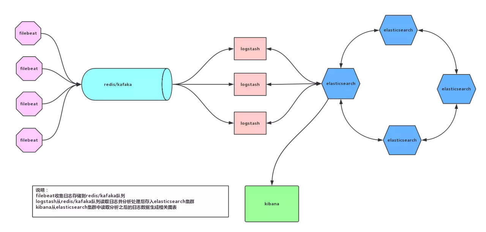

# 日志

## 日志形式

* 文件日志（LogFile）
* 事件（Event）
* 数据库日志（BinLog）
* 度量（Metric）

## 通用日志收集系统

架构说明：

* 日志收集与处理解耦
* 由于收集和处理过程间加入了队列，当日志出现暴增时，可以避免分析处理节点被打垮，给分析处理节点足够时间消化日志数据
* 日志分析处理节点可以动态伸缩

## 大流量日志收集系统

架构说明：

* 当日志流量过大时，如果每一个日志收集节点都直连队列写数据，由于有很多分散的连接及写请求，会给队列造成压力。如果日志都发送到logstash收集节点，再集中写入队列，会减轻队列压力。

## 参考

* [日志采集中的关键技术分析](http://jm.taobao.org/2018/06/13/%E6%97%A5%E5%BF%97%E9%87%87%E9%9B%86%E4%B8%AD%E7%9A%84%E5%85%B3%E9%94%AE%E6%8A%80%E6%9C%AF%E5%88%86%E6%9E%90/)
* [分布式实时日志分析解决方案 ELK 部署架构](http://www.importnew.com/27705.html)