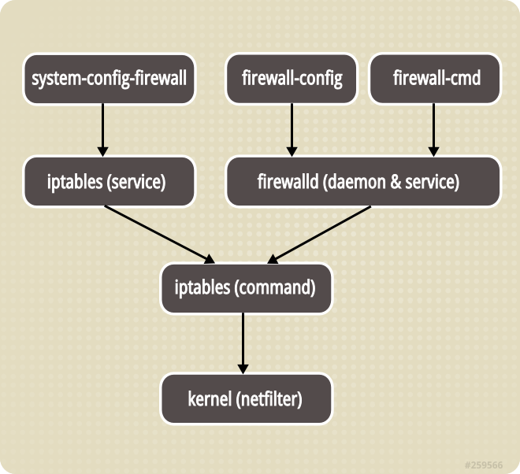

# CentOS Firewalld

从 CentOS 7 开始，默认使用了 `firewalld` 来代替 `iptables`。

`firewalld` 使用服务（service）和区域（zone）来代替 `iptables` 的规则（rule）和链（chain）。Firwalld 是 iptables 的前端控制器，它是对 iptables 的一个封装。

## 对比 iptables



## 启用

```bash
systemctl start firewalld

systemctl enable firewalld
```

## 区域（zone）

* drop: 丢弃所有传入的网络数据包并且无回应，只有传出网络连接可用。
* block: 拒绝所有传入网络数据包并回应一条主机禁止的 ICMP 消息，只有传出网络连接可用。
* public: 只接受被选择的传入网络连接，用于公共区域。
* external: 用于启用了地址伪装的外部网络，只接受选定的传入网络连接。
* dmz: DMZ 隔离区，外部受限地访问内部网络，只接受选定的传入网络连接。
* work: 对于处在你工作区域内的计算机，只接受被选择的传入网络连接。
* home: 对于处在你家庭区域内的计算机，只接受被选择的传入网络连接。
* internal: 对于处在你内部网络的计算机，只接受被选择的传入网络连接。
* trusted: 所有网络连接都接受。

```bash
# 列出所有可用 zone
$ firewall-cmd --get-zones
work drop internal external trusted home dmz public block

# 列出默认 zone
$ firewall-cmd --get-default-zone
public

# 更改默认 zone
$ firewall-cmd --set-default-zone=dmz
```

## 服务（service）

```bash
# 列出所有可用的服务
# XML 配置文件存储在 /usr/lib/firewalld/services/ 和 /etc/firewalld/services/
$ firewall-cmd --get-services
RH-Satellite-6 amanda-client amanda-k5-client bacula bacula-client ceph ceph-mon dhcp dhcpv6 dhcpv6-client dns docker-registry dropbox-lansync freeipa-ldap freeipa-ldaps freeipa-replication ftp high-availability http https imap imaps ipp ipp-client ipsec iscsi-target kadmin kerberos kpasswd ldap ldaps libvirt libvirt-tls mdns mosh mountd ms-wbt mysql nfs ntp openvpn pmcd pmproxy pmwebapi pmwebapis pop3 pop3s postgresql privoxy proxy-dhcp ptp pulseaudio puppetmaster radius rpc-bind rsyncd samba samba-client sane smtp smtps snmp snmptrap squid ssh synergy syslog syslog-tls telnet tftp tftp-client tinc tor-socks transmission-client vdsm vnc-server wbem-https xmpp-bosh xmpp-client xmpp-local xmpp-server
```