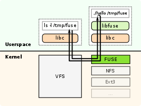

# FUSE

FUSE（Filesystem in Userspace，即用户空间文件系统）是 Unix 和 Unix-like 操作系统的软件接口，它允许非特权用户在用户空间创建（或访问）自己的文件系统而无需修改内核代码或重新编译内核。这种方式通过在用户空间运行文件系统代码来实现，而 FUSE 模块则为实际的内核接口提供 “桥接” 功能。

## 组成部分

* 内核 FUSE 模块
* 用户态 Libfuse 库

## 工作原理

1. 建议先熟悉 [虚拟文件系统](VFS.md)
2. 用户空间通过系统调用向内核发起请求 `ls -l /tmp/fuse`
3. 内核将接收到的请求从 VFS 重定向到 FUSE
4. FUSE 执行已注册的句柄程序（`.hello`）并将请求（`ls -l /tmp/fuse`）传递给它
5. 句柄程序返回响应给 FUSE
6. FUSE 将响应重定向给 VFS
7. VFS 响应给发起请求的用户空间程序

> 思考：libcephfs 与 cephfs-fuse 的区别？

## 内核存储堆栈

## 优缺点

优点：

* 用户无需编辑内核代码即可创建自定义文件系统
* User Space 实现的文件系统相比于 Kenel Space 实现的文件系统更加灵活、更易维护（比如统一两端版本），并且可以和内核解耦

## 用例

* GlusterFS
* CephFS
* FTPFS
* IPFS
* NTFS-3G - 允许访问 NTFS 文件系统
* SSHFS
* WebDrive

## 参考

* [libfuse/libfuse](https://github.com/libfuse/libfuse)
* [Filesystem in Userspace](https://en.wikipedia.org/wiki/Filesystem_in_Userspace)
* [用户态文件系统 ( FUSE ) 框架分析和实战](https://cloud.tencent.com/developer/article/1006138)