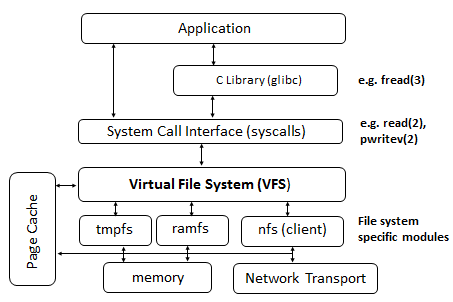

# 虚拟文件系统（Virtual File System）

_虚拟文件系统_（Virtual File System，简称 VFS）也称为 _虚拟文件系统转换器_（Virtual Filesystem Switch，亦称 VFS），是具体文件系统（如 EXT4、NTFS 等）之上的一个抽象层，允许客户端应用程序以 **统一的方式** 透明地访问不同的文件系统，而无需过问具体文件系统的实现细节。VFS 弥合了 Windows、macOS 和 Unix 之间的文件系统差异。

VFS 针对各类文件系统定义了一套通用接口，所有文件系统必须实现该接口，与此同时应用程序能够按照该接口（通过系统调用）访问文件系统功能。

## 内核存储堆栈

VFS 层在 Linux 内核存储堆栈各个部分中的位置：

