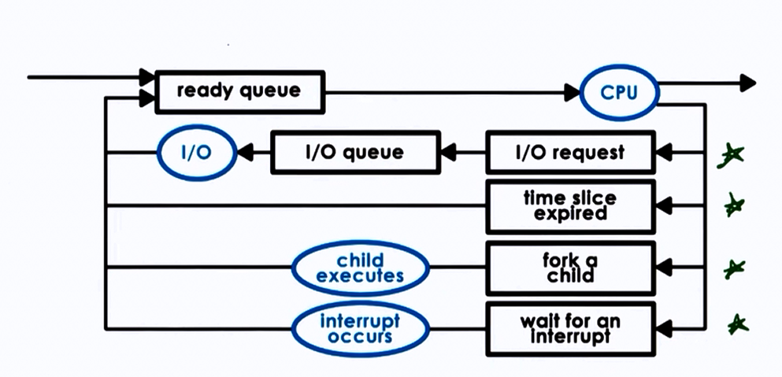

# 进程调度和管理

进程（也称为任务）是程序执行和加载到内存时的状态。进程是资源分配的基本单位

* 进程凭证
* 进程的创建
* 进程的终止
* 监控子进程
* 程序的执行
* 详述进程创建和程序执行

---

* 进程组、会话和作业控制
* 进程优先级和调度
* 进程资源
* 进程间通信（IPC）简介
* POSIX IPC 介绍
* POSIX 消息队列

---

* Signal handling
* Process/thread creation & termination
* Process Scheduler

## 目录

* 进程标识符

## 上下文切换

## I/O

## 参考

* [Process state](https://en.wikipedia.org/wiki/Process_state)
* [Process State Definition](http://www.linfo.org/process_state.html)
* [Linux 进程状态](https://www.cnblogs.com/diegodu/p/9167671.html)