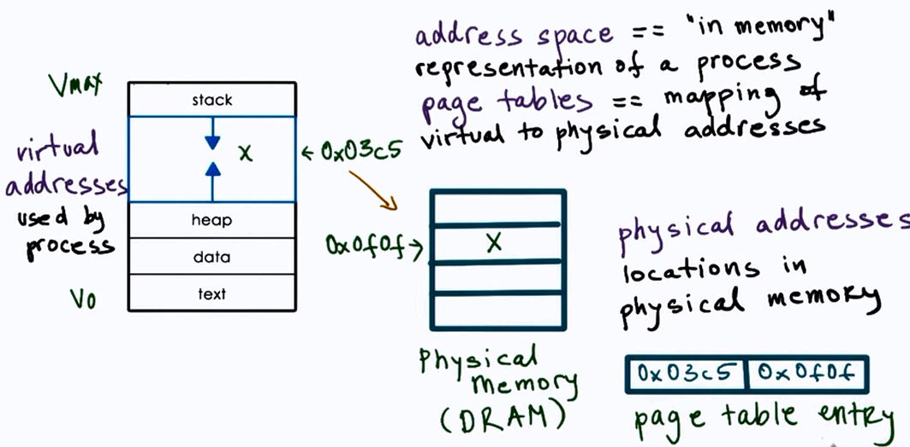
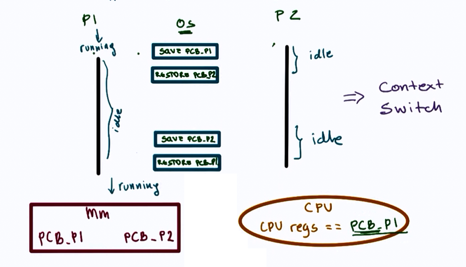

# 进程调度和管理

进程（也称为任务）是程序执行和加载到内存时的状态。进程是资源分配的基本单位

* 进程凭证
* 进程的创建
* 进程的终止
* 监控子进程
* 程序的执行
* 详述进程创建和程序执行

---

* 进程组、会话和作业控制
* 进程优先级和调度
* 进程资源
* 进程间通信（IPC）简介
* POSIX IPC 介绍
* POSIX 消息队列

## 进程虚拟地址空间

| -     | 描述                                             |
| ----- | ------------------------------------------------ |
| Stack | 包含临时数据，例如方法、函数、返回地址和局部变量 |
| Heap  | 运行时为进程动态分配的内存                       |
| Data  | 包含全局变量和静态变量                           |
| Text  | 程序计数器的值和处理器寄存器的内容表示的当前活动 |

## 进程控制块（PCB）

* 进程创建时，PCB 被创建
* 当进程状态改变是，更新某些字段

## 上下文切换

## I/O

## 参考

* [Process state](https://en.wikipedia.org/wiki/Process_state)
* [Process State Definition](http://www.linfo.org/process_state.html)
* [Linux 进程状态](https://www.cnblogs.com/diegodu/p/9167671.html)